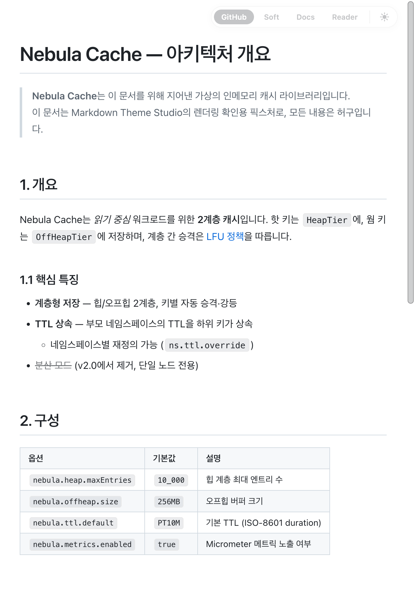
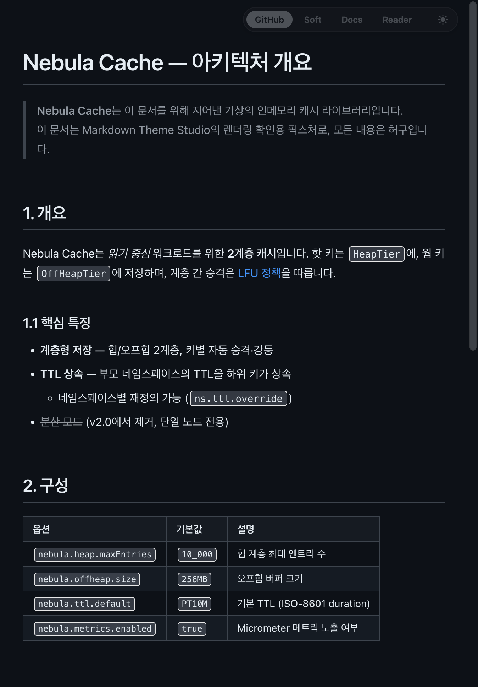
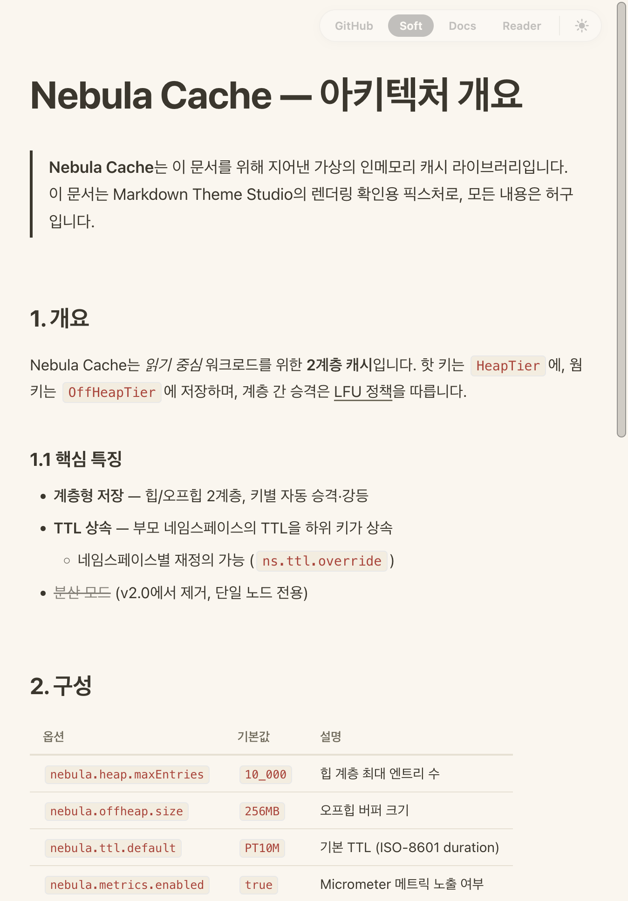
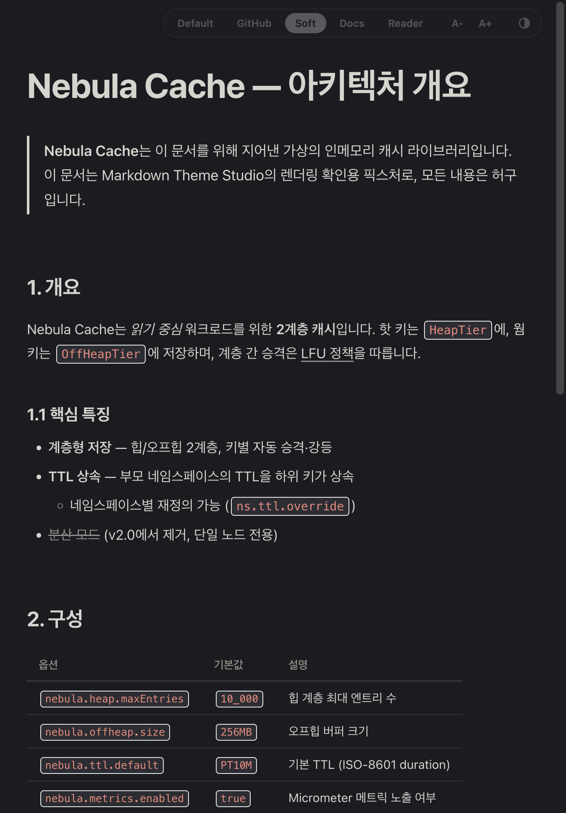
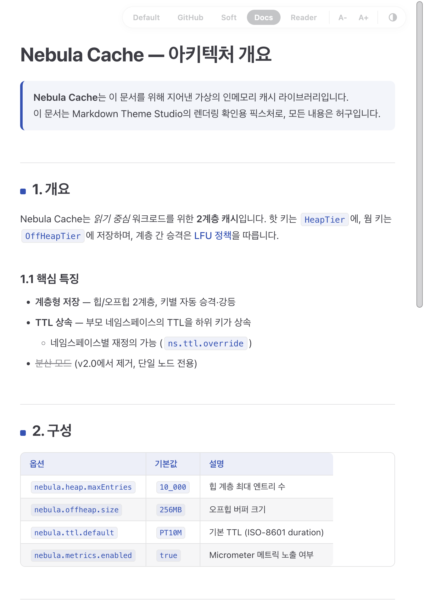
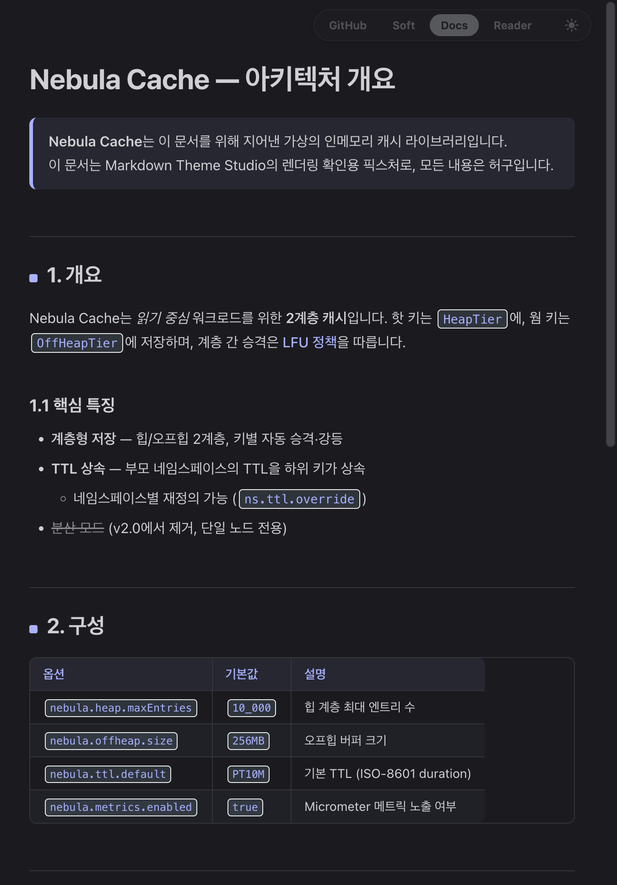
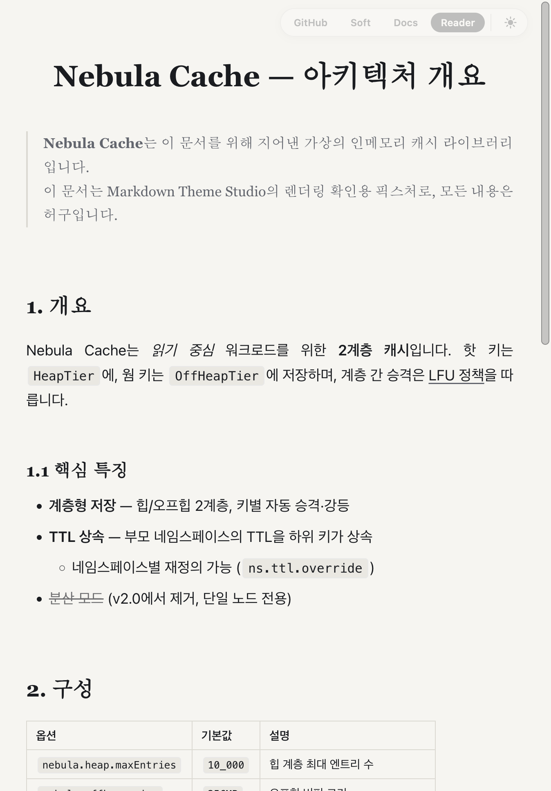
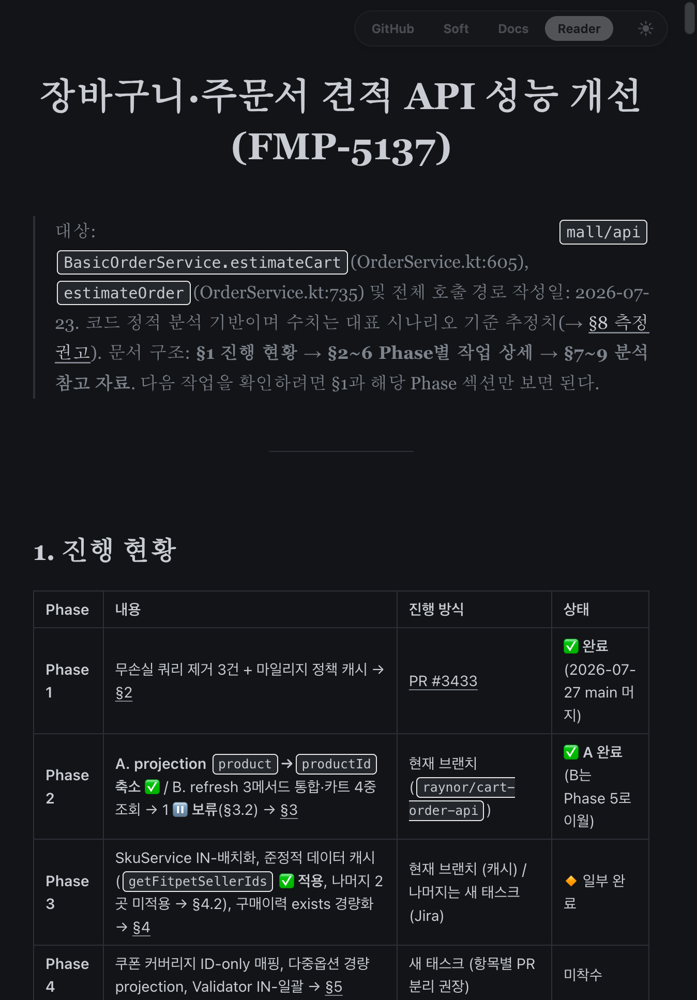

# Markdown Theme Studio

JetBrains IDE의 기본 Markdown preview 가독성을 개선하는 플러그인입니다. 번들 Markdown 플러그인의 렌더링 파이프라인(파싱, 싱크 스크롤, 코드 하이라이트)은 그대로 두고 스타일만 재정의합니다.

- **테마 4종 + Default** — 타이포그래피, 코드 블록, 표, CJK 텍스트에 맞춰 다듬은 테마를 preview 우측 상단 스위처에서 바로 전환. Default를 고르면 기본 preview 스타일로 복귀
- **폰트 크기 조절** — 스위처의 A- / A+ 버튼으로 ±3px 조절
- **라이트/다크 자동 추종** — IDE 테마를 따라가며, 수동 고정(auto / light / dark)도 가능
- **선택 기억** — 테마·외관·폰트 크기 설정은 localStorage에 저장되어 유지
- **프로젝트 커스텀 CSS 위에서도 동작** — `.idea/markdown.xml`의 기존 커스텀 CSS(예: Typora 이식 스니펫)가 있어도 테마가 우선 적용

## 테마

| 테마 | 성격 |
|---|---|
| **GitHub** | GitHub 문서 스타일에 충실한 기본 테마 |
| **Soft** | 크림 톤 배경의 편안한 저대비 테마 |
| **Docs** | 인디고 포인트의 기술 문서 스타일 |
| **Reader** | serif 헤딩, 좁은 본문 폭의 긴 글 읽기용 테마 |

### 미리보기

| | 라이트 | 다크 |
|---|---|---|
| **GitHub** |  |  |
| **Soft** |  |  |
| **Docs** |  |  |
| **Reader** |  |  |

## 설치

지원 범위: **2025.1 ~ 2026.x** (IntelliJ 등 번들 Markdown 플러그인이 있는 JetBrains IDE)

1. 플러그인 zip 빌드 (또는 배포된 zip 사용)

   ```
   ./gradlew buildPlugin
   ```

   → `build/distributions/markdown-theme-studio-<버전>.zip`

2. IDE에서 **Settings → Plugins → ⚙️ → Install Plugin from Disk…** 로 zip 선택 후 재시작

## 사용법

Markdown preview 우측 상단의 스위처에서 테마를 클릭해 전환합니다. **Default**는 플러그인 스타일을 끄고 기본 preview로 되돌립니다. **A- / A+**는 본문 폰트 크기를 조절하고, 맨 오른쪽 버튼은 외관(auto/light/dark)을 순환합니다. 스크롤을 내리면 스위처가 작은 점으로 접히고, 점에 커서를 올리면 다시 펼쳐집니다.

## 개발

```
./gradlew runIde        # IC 2025.1 샌드박스 실행
./gradlew buildPlugin   # 배포 zip 생성
./gradlew test          # 단위 테스트
./gradlew verifyPlugin  # 지원 IDE 범위 바이너리 호환성 검사
tools/build-zip.sh      # 배포 zip 빌드 + 패키징 검증 (테스트 포함)
```

구조는 소스 3파일이 전부입니다.

- `ThemeStudioPreviewExtension.kt` — `browserPreviewExtensionProvider` 확장점 구현. CSS/JS를 preview에 서빙
- `themes/mts.css` — 테마 스타일. `html[data-mts-theme]` 스코프라 속성이 없으면 기본 preview 그대로
- `themes/mts.js` — 스위처 위젯과 테마/외관 상태 관리

자세한 아키텍처와 플랫폼 제약은 [CLAUDE.md](CLAUDE.md)를 참고하세요.

## 라이선스

[MIT](LICENSE)
